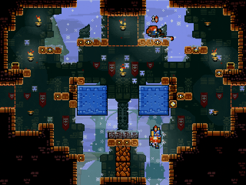

# Towerfall-Redemption
<!-- ABOUT THE PROJECT -->
***You NEED FortRise for this to work! Get it from https://github.com/Terria-K/FortRise***

***Thank you, Terria and RedDude! This would not be possible without your support!***

Enjoy new arrows, mechanics, towers, hazards, and gui!

## Done:
### Menu Variants Mod
Adds Custom Titles and Bezels!

Credits: CoolModder

Latest Release: https://github.com/CoolModder/Towerfall-Redemeption/releases/tag/V2.5.0-Menu

### Oops, All Arrows Mod
Enjoy the chaos of ten new arrows, with more on the way!

List of Arrows and Variants: [Oops, All Arrows Mod Wiki Page](https://github.com/CoolModder/Towerfall-Redemption/wiki/Oops,-All-Arrows-Mod)

Credits: CoolModder, Footage from LuckySeven and UJelly12

Latest Release:  https://github.com/CoolModder/Towerfall-Redemption/releases/tag/v4.0.0-Arrows
### TowerBall
Port of Towerball to Fortrise! 

Credits: Original mod by Suyoo (at https://suyo.be/towerball/), Ported by CoolModder, 4.1.0 and WiderSetMod support by Terria

Ball Sound by Zmobie licensed under the Creative Commons 0 License. http://www.freesound.org/people/zmobie/sounds/319765/

Latest Release: https://github.com/CoolModder/Towerfall-Redemeption/releases/tag/v2.0.0-Ball
### Seasonal Chest Mod
Change up the chests near holidays!

Credits: CoolModder

Latest Release: https://github.com/CoolModder/Towerfall-Redemeption/releases/tag/V1.0.0-Chest
### Warlord 
How the canceled gamemode could of been... Grab the helm and survive to win, or kill the warlord and be the last one left to score

Credits: CoolModder

Latest Release: https://github.com/CoolModder/Towerfall-Redemption/releases/tag/v1.5.0-Warlord

### No Seek Quest
Challenge yourself to beat Co-op without arrow seek!

Credits: CoolModdder, concept by Jan-Kleks

Latest Release: https://github.com/CoolModder/Towerfall-Redemption/releases/tag/v1.0.0-NoSeek
## Todo:

### Pets
New creatures from the Dark World have arrived! Use the new net arrows to capture them. Trap and free them to gain their powerful boosts!
### Monsters
It seems some of the pet's parents came with them. These new beasts will destroy all who oppose them, so be wary.
### Gui Overhaul
Sick of the bland gems on the screen?
### Supers
Charge up supers, then unleash them to destroy any who oppose you.

## In Progress:
### Custom Arrows
Enjoy many custom arrows, all ready to shake up the competition!
### Seasonal Chests
Chests are replaced for different holidays
### Menu Variants Mod Update 
Custom music support!
### Warlord mod fixes 
Fix UI bug, etc.
## Other things by me:
### Towerfall Atlas Editior Script for Asesprite
https://github.com/CoolModder/Asesprite-TF-Atlas-Editior/tree/main
